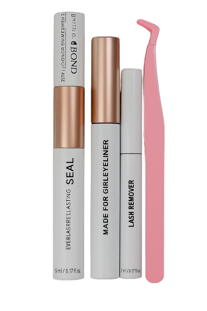

<!DOCTYPE html>
<html lang="en">
<head>
    <meta charset="UTF-8">
    <meta name="viewport" content="width=device-width, initial-scale=1.0">
    <title>Genevieves Boutique - Unlimited Lash Heaven</title>
    <!-- Tailwind CSS CDN -->
    
    <!-- Font Awesome for icons -->
    <link rel="stylesheet" href="https://cdnjs.cloudflare.com/ajax/libs/font-awesome/6.0.0-beta3/css/all.min.css">
    <!-- Google Fonts - Inter -->
    <link href="https://fonts.googleapis.com/css2?family=Inter:wght@300;400;500;600;700&display=swap" rel="stylesheet">
    
</head>
<body class="font-inter antialiased text-gray-800 bg-white">

    <!-- Header Section -->
    <header class="fixed w-full bg-white shadow-md z-50 animate-fade-in-down">
        <nav class="container mx-auto px-6 py-4 flex justify-between items-center">
            <!-- Logo -->
            

                <!-- Logo size set to h-12 (48px), border and shadow removed for blending -->
                
                <!-- "Genevieves Boutique" text now visible on all screen sizes -->
                Genevieves Boutique
            

            <!-- Desktop Navigation -->
            

                <a href="#home" class="text-gray-700 hover:text-pink-600 transition duration-300 cursor-pointer text-lg font-medium">Home</a>
                <a href="#products" class="text-gray-700 hover:text-pink-600 transition duration-300 cursor-pointer text-lg font-medium">Products</a>
                <a href="#about" class="text-gray-700 hover:text-pink-600 transition duration-300 cursor-pointer text-lg font-medium">About</a>
                <a href="#contact" class="text-gray-700 hover:text-pink-600 transition duration-300 cursor-pointer text-lg font-medium">Contact</a>
            

            <!-- Mobile Menu Button -->
            

                <button id="mobile-menu-button" class="text-gray-700 focus:outline-none focus:text-pink-600">
                    <svg id="menu-icon-open" class="h-8 w-8" fill="none" viewBox="0 0 24 24" stroke="currentColor">
                        <path stroke-linecap="round" stroke-linejoin="round" stroke-width="2" d="M4 6h16M4 12h16M4 18h16" />
                    </svg>
                    <svg id="menu-icon-close" class="h-8 w-8 hidden" fill="none" viewBox="0 0 24 24" stroke="currentColor">
                        <path stroke-linecap="round" stroke-linejoin="round" stroke-width="2" d="M6 18L18 6M6 6l12 12" />
                    </svg>
                </button>
            

        </nav>

        <!-- Mobile Navigation -->
        

            <a href="#home" class="block px-6 py-2 text-gray-700 hover:bg-pink-100 transition duration-300 cursor-pointer text-lg font-medium">Home</a>
            <a href="#products" class="block px-6 py-2 text-gray-700 hover:bg-pink-100 transition duration-300 cursor-pointer text-lg font-medium">Products</a>
            <a href="#about" class="block px-6 py-2 text-gray-700 hover:bg-pink-100 transition duration-300 cursor-pointer text-lg font-medium">About</a>
            <a href="#contact" class="block px-6 py-2 text-gray-700 hover:bg-pink-100 transition duration-300 cursor-pointer text-lg font-medium">Contact</a>
        

    </header>

    <!-- Hero Section -->
    <section id="home" class="relative h-screen flex items-center justify-center bg-gradient-to-r from-pink-100 to-purple-100 overflow-hidden pt-16">
        <!-- Background animation elements -->
        

            

            

            

        

        

            <h1 class="text-5xl md:text-7xl font-extrabold text-gray-900 leading-tight mb-6 drop-shadow-lg">
                Unleash Your Inner Radiance
            </h1>
            

                Discover the secret to captivating eyes and effortless beauty with Genevieves Boutique's premium lash collections.
            

            <button
                onclick="scrollToSection('products')"
                class="px-8 py-4 bg-pink-600 text-white font-semibold rounded-full shadow-lg hover:bg-pink-700 transform hover:scale-105 transition duration-300 ease-in-out focus:outline-none focus:ring-4 focus:ring-pink-300"
            >
                Explore Our Collections
            </button>
        

    </section>

    <!-- Products Section -->
    <section id="products" class="py-16 bg-white">
        

            <h2 class="text-4xl font-bold text-center text-gray-900 mb-12 animate-fade-in-up">Our Exquisite Collections</h2>

            <!-- New Collection -->
            

                <h3 class="text-3xl font-semibold text-center text-pink-600 mb-8">New Arrivals</h3>
                

                    <!-- Product Card 1: New Collection Essentials -->
                    

                        
                        

                            <h3 class="text-xl font-semibold text-gray-900 mb-2">New Collection Essentials</h3>
                            
Bond, Seal, Lash Remover, and Tweezers for a perfect application.

                            

                                R150
                                <button class="px-5 py-2 bg-pink-500 text-white rounded-full text-sm font-medium hover:bg-pink-600 transition duration-300 transform hover:shadow-md">
                                    Add to Cart
                                </button>
                            

                        

                    

                    <!-- Product Card 2: Complete Lash Kit -->
                    

                        
                        

                            <h3 class="text-xl font-semibold text-gray-900 mb-2">Complete Lash Kit</h3>
                            
Everything you need for stunning lashes: shampoo, curler, glue, and more.

                            

                                R450
                                <button class="px-5 py-2 bg-pink-500 text-white rounded-full text-sm font-medium hover:bg-pink-600 transition duration-300 transform hover:shadow-md">
                                    Add to Cart
                                </button>
                            

                        

                    

                    <!-- Product Card 3: Lash Starter Kit (placeholder) -->
                    

                        
                        

                            <h3 class="text-xl font-semibold text-gray-900 mb-2">Lash Starter Kit</h3>
                            
Your journey to beautiful lashes starts here with 3 cluster sets and tools.

                            

                                R350
                                <button class="px-5 py-2 bg-pink-500 text-white rounded-full text-sm font-medium hover:bg-pink-600 transition duration-300 transform hover:shadow-md">
                                    Add to Cart
                                </button>
                            

                        

                    

                

            

            <!-- Special Products -->
            

                <h3 class="text-3xl font-semibold text-center text-pink-600 mb-8">Specialty Products</h3>
                

                    <!-- Product Card 4 -->
                    

                        
                        

                            <h3 class="text-xl font-semibold text-gray-900 mb-2">Magnetic Eyelashes Combo</h3>
                            
Effortless 'up and go' magnetic lashes for a natural, captivating look.

                            

                                R250
                                <button class="px-5 py-2 bg-pink-500 text-white rounded-full text-sm font-medium hover:bg-pink-600 transition duration-300 transform hover:shadow-md">
                                    Add to Cart
                                </button>
                            

                        

                    

                    <!-- Product Card 5 -->
                    

                        
                        

                            <h3 class="text-xl font-semibold text-gray-900 mb-2">Lash Lift Kit</h3>
                            
Achieve a professional lash lift at home for long-lasting curl.

                            

                                R250
                                <button class="px-5 py-2 bg-pink-500 text-white rounded-full text-sm font-medium hover:bg-pink-600 transition duration-300 transform hover:shadow-md">
                                    Add to Cart
                                </button>
                            

                        

                    

                    <!-- Product Card 6 -->
                    

                        
                        

                            <h3 class="text-xl font-semibold text-gray-900 mb-2">Plush Comfort Teddies</h3>
                            
Soft and cuddly teddy bears, perfect for a special gift or a cozy companion.

                            

                                R300
                                <button class="px-5 py-2 bg-pink-500 text-white rounded-full text-sm font-medium hover:bg-pink-600 transition duration-300 transform hover:shadow-md">
                                    Add to Cart
                                </button>
                            

                        

                    

                

            

            <!-- Combos and Individual Items -->
            

                <h3 class="text-3xl font-semibold text-center text-pink-600 mb-8">Combos & Individual Items</h3>
                

                    <!-- Combos -->
                    

                        <h4 class="text-2xl font-bold text-gray-800 mb-4">Combos</h4>
                        <ul class="space-y-3 text-lg text-gray-700">
                            <li class="flex justify-between items-center">
                                The Ordinary
                                R120
                            </li>
                            <li class="flex justify-between items-center">
                                Bond & Seal / Tweezers / Remover
                                R150
                            </li>
                            <li class="flex justify-between items-center">
                                Lash Starter Kit
                                R350
                            </li>
                            <li class="flex justify-between items-center">
                                All You Need Kit
                                R450
                            </li>
                        </ul>
                    

                    <!-- Individual Items -->
                    

                        <h4 class="text-2xl font-bold text-gray-800 mb-4">Individual Items</h4>
                        <ul class="space-y-3 text-lg text-gray-700">
                            <li class="flex justify-between items-center">
                                Mini False Eyelash Remover Kit (29pcs)
                                R180
                            </li>
                            <li class="flex justify-between items-center">
                                Mini Eyelash Extension Kit (31pcs)
                                R300
                            </li>
                            <li class="flex justify-between items-center">
                                Eyelash Curler
                                R100
                            </li>
                            <li class="flex justify-between items-center">
                                Electric Hot Eyelash Curler
                                R199.99
                            </li>
                            <li class="flex justify-between items-center">
                                Lash Mouse Mild
                                R150
                            </li>
                            <li class="flex justify-between items-center">
                                Waterproof Lash Glue
                                R200
                            </li>
                            <li class="flex justify-between items-center">
                                Eyelash Cleaner
                                R45.00
                            </li>
                            <li class="flex justify-between items-center">
                                Eyelash Mirror Mini
                                R45.00
                            </li>
                        </ul>
                    

                

            

        

    </section>

    <!-- About Section -->
    <section id="about" class="py-16 bg-gradient-to-br from-pink-50 to-purple-50">
        

            <h2 class="text-4xl font-bold text-gray-900 mb-8 animate-fade-in-up">About Genevieves Boutique</h2>
            

                At Genevieves Boutique, we believe that beauty is an expression of self-love and confidence. We are dedicated to providing high-quality, innovative lash products and beauty essentials that empower you to look and feel your absolute best. Our mission is to bring "unlimited lash heaven" to every customer, ensuring a seamless and luxurious beauty experience. We carefully curate our collections to offer the latest trends and most effective solutions, helping you achieve captivating eyes with ease.
            

        

    </section>

    <!-- Contact Section -->
    <section id="contact" class="py-16 bg-white">
        

            <h2 class="text-4xl font-bold text-center text-gray-900 mb-12 animate-fade-in-up">Get in Touch</h2>
            

                <form class="space-y-6">
                    

                        <label for="name" class="block text-lg font-medium text-gray-700 mb-2">Name</label>
                        <input
                            type="text"
                            id="name"
                            name="name"
                            class="mt-1 block w-full px-4 py-3 border border-gray-300 rounded-md shadow-sm focus:ring-pink-500 focus:border-pink-500 sm:text-lg transition duration-200"
                            placeholder="Your Name"
                            required
                        />
                    

                    

                        <label for="email" class="block text-lg font-medium text-gray-700 mb-2">Email</label>
                        <input
                            type="email"
                            id="email"
                            name="email"
                            class="mt-1 block w-full px-4 py-3 border border-gray-300 rounded-md shadow-sm focus:ring-pink-500 focus:border-pink-500 sm:text-lg transition duration-200"
                            placeholder="your.email@example.com"
                            required
                        />
                    

                    

                        <label for="message" class="block text-lg font-medium text-gray-700 mb-2">Message</label>
                        <textarea
                            id="message"
                            name="message"
                            rows="5"
                            class="mt-1 block w-full px-4 py-3 border border-gray-300 rounded-md shadow-sm focus:ring-pink-500 focus:border-pink-500 sm:text-lg transition duration-200"
                            placeholder="How can we help you?"
                            required
                        ></textarea>
                    

                    <button
                        type="submit"
                        class="w-full px-6 py-3 bg-pink-600 text-white font-semibold rounded-full shadow-lg hover:bg-pink-700 transform hover:scale-105 transition duration-300 ease-in-out focus:outline-none focus:ring-4 focus:ring-pink-300"
                    >
                        Send Message
                    </button>
                </form>
            

        

    </section>

    <!-- Footer -->
    <footer class="bg-gray-800 text-white py-8">
        

            
&copy;  Genevieves Boutique. All rights reserved.

            

                <a href="#" class="text-gray-400 hover:text-white transition duration-300">
                    <i class="fab fa-facebook-f text-2xl"></i>
                </a>
                <a href="#" class="text-gray-400 hover:text-white transition duration-300">
                    <i class="fab fa-instagram text-2xl"></i>
                </a>
                <a href="#" class="text-gray-400 hover:text-white transition duration-300">
                    <i class="fab fa-twitter text-2xl"></i>
                </a>
            

        

    </footer>

    
</body>
</html>
